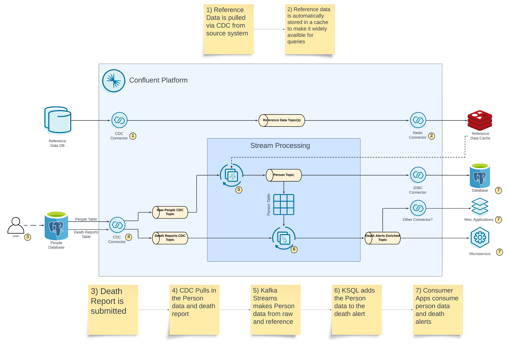

# Person Alerts Demo

Demonstrates serveral capabilities:
- CDC of raw data
- Generate business entities from CDC data
- Syncing reference data with an external cache
- Joining CDC events with business entities to form composite events
- Multiple consumers of the composite events

## Setup
Stand up docker environment

    docker compose up -d

Initialize data sources and connectors

    ./start.sh

Start the Kafka Streams application

    cd person-builder-app
    ./gradlew run

Create the ksqldb applications

    1) open control center http://localhost:9021
    2) open the ksqldb editor
    3) set auto.offset.reset to "earliest"
    4) copy the contents of ksqldb/create-person-streams.sql into the editor
    5) execute the statements

Start the sink connectors

    1) open control center http://localhost:9021
    2) open the create new connectors form
    3) select upload a connector config
        3.1) upload connect-configs/person-postgres-sink.json
        3.2) TODO

## Explore

### Enriched Person Entities
Review the enriched Person data being genereted by the streaming application.  The enriched People entities are published to the `person.avro` topic.  The `person-builder-app` transforms the raw CDC data, joins it with reference data cached in Redis, and generates `Person` entities suitable for sharing across the organization.

### Death Alerts
Death reports are added to the postgreSQL table `death_reports`.  Adding an entry to this table will trigger the creation of a "Death Alert".  The ksqlDB application will join the new Death Report with the corresponding enriched Person entity, and publish an enriched event for consumption by downstream applications.

Add a Death Report:

    1) Open Adminer: http://localhost:8888
    2) Login to the postgreSQL database:
        System: PostgreSQL
        Server: postgres
        Username: myuser
        Password: mypassword
        Database: postgres
    3) Select the table "death_reports"
    4) Select "New item"
    5) Enter the details of a new death report entry (use a cossn matching a Person from the person_info table)
    6) Click Save

Review the death alert in Kafka by viewing the contents of the `person.death.alert.avro` topic.

## Teardown
Remove environment

    docker compose down

## Utilities

Start Redis CLI

    docker compose exec redis redis-cli

Inspect Redis Cache (using CLI)

    SELECT 1
    GET "{\"zip_code\":\"90210\"}"
    exit

