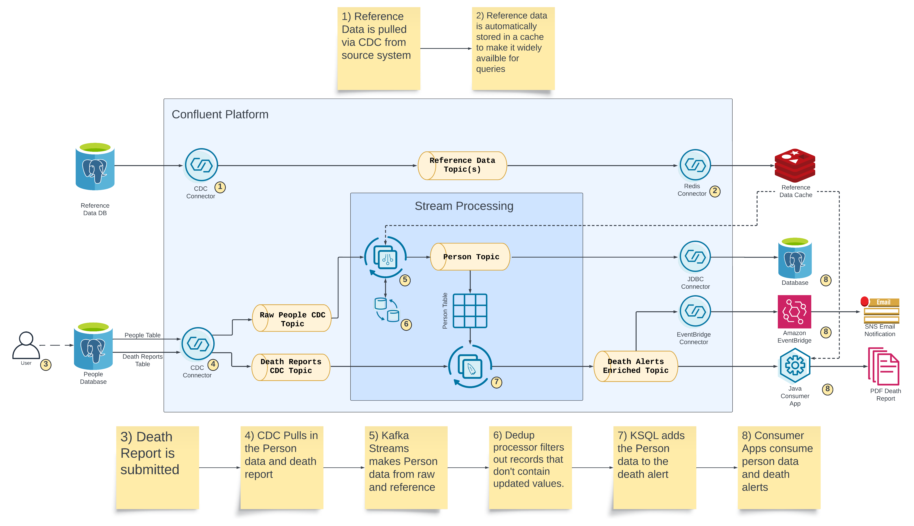

# Person Alerts Demo

Demonstrates serveral capabilities:
- CDC of raw data
- Generate business entities from CDC data
- Syncing reference data with an external cache
- Joining CDC events with business entities to form composite events
- Multiple consumers of the composite events

## Setup
Stand up docker environment

    docker compose up -d

Initialize data sources and connectors

    ./start.sh

Start the Kafka Streams application

    cd person-builder-app
    ./gradlew run

Create the ksqldb applications

    1) open control center http://localhost:9021
    2) open the ksqldb editor
    3) set auto.offset.reset to "earliest"
    4) copy the contents of ksqldb/create-person-streams.sql into the editor
    5) execute the statements

Start the sink connectors

    1) open control center http://localhost:9021
    2) open the create new connectors form
    3) select upload a connector config
        3.1) upload connect-configs/person-postgres-sink.json
        3.2) TODO

## Teardown
Remove environment

    docker compose down

## Utilities

Start Redis CLI

    docker compose exec redis redis-cli

Inspect Redis Cache (using CLI)

    SELECT 1
    GET "{\"zip_code\":\"90210\"}"
    exit

